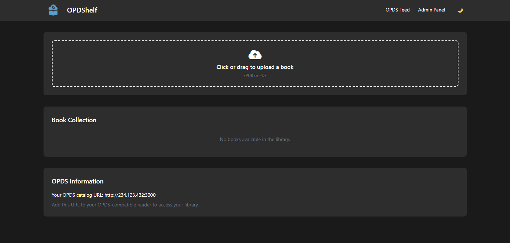

<p align="center"><em>What if you could host your own OPDS library server in seconds?</em></p>
<h1 align="center">OPDShelf</h1>
<p align="center"><a href="#installation">Install</a> • <a href="#configuration">Configuration</a> • <a href="https://github.com/koalilla/opds-server/issues">Issues</a></p>



## Features

### Simple book hosting
* Upload EPUB and PDF files via web UI
* Download books from your browser or any OPDS-compatible reader
* Delete books from the admin panel
* OPDS 1.x feed for easy integration with e-readers

### Fast and lightweight
* Minimal dependencies
* Runs as a single Go binary or Docker container
* Responsive web admin panel

### Easy to use
* Drag-and-drop or click to upload
* No database required
* Works on Windows, Linux, macOS, and ARM devices

### Mobile-friendly
* Admin panel and OPDS feed accessible from any device

<br>

## Configuration

No configuration is required for basic usage. By default, books are stored in the `books/` directory. You can change the port, host, and books directory using environment variables:

| Variable    | Default      | Description                |
|-------------|--------------|----------------------------|
| PORT        | 3000         | Port to listen on          |
| HOST        | 0.0.0.0      | Host to bind to            |
| BOOKS_DIR   | ./books      | Directory to store books   |

You can set these in your Docker Compose file or as environment variables when running the binary.

<br>

## Installation

Choose one of the following methods:

<details>
<summary><strong>Docker Compose (recommended)</strong></summary>
<br>

Create a `docker-compose.yml` file:

```yaml
version: '3.8'
services:
  opds-server:
    image: koalilla/opds-server:latest
    container_name: opds-server
    ports:
      - "3000:3000"
    volumes:
      - ./books:/app/books
    restart: unless-stopped
    environment:
      - PORT=3000
      - HOST=0.0.0.0
      - BOOKS_DIR=/app/books
```

Then run:

```bash
docker compose up -d
```

Access the admin panel at [http://localhost:3000/admin](http://localhost:3000/admin)

</details>

<details>
<summary><strong>Manual binary installation</strong></summary>
<br>

1. Download the latest release for your OS from the [releases page](https://github.com/koalilla/opds-server/releases).
2. Extract the binary and run it:

```bash
./opds-server
```

3. Visit [http://localhost:3000/admin](http://localhost:3000/admin) to upload books.

</details>

<br>

## Common issues
<details>
<summary><strong>Books not showing up</strong></summary>
Make sure your files are in the correct `books/` directory and have the `.epub` or `.pdf` extension.
</details>

<details>
<summary><strong>Cannot upload large files</strong></summary>
The default upload limit is 100MB. For larger files, increase the server's max upload size in the code or reverse proxy.
</details>

<br>

## FAQ
<details>
<summary><strong>What is OPDS?</strong></summary>
OPDS (Open Publication Distribution System) is a standard for sharing digital books via web feeds, supported by many e-readers and apps.
</details>

<details>
<summary><strong>How do I access my library from an e-reader?</strong></summary>
Add your server's OPDS URL (shown in the admin panel) to your reader app.
</details>

<details>
<summary><strong>How do I change the port or books directory?</strong></summary>
Set the `PORT`, `HOST`, or `BOOKS_DIR` environment variables before starting the server.
</details>

<br>

## Building from source

Requirements: [Go](https://go.dev/dl/) >= v1.23

```bash
go build -o opds-server .
```

<br>

## Contributing

Pull requests and issues are welcome! Please open an issue to discuss new features before submitting a PR.

<br>

## License

MIT
